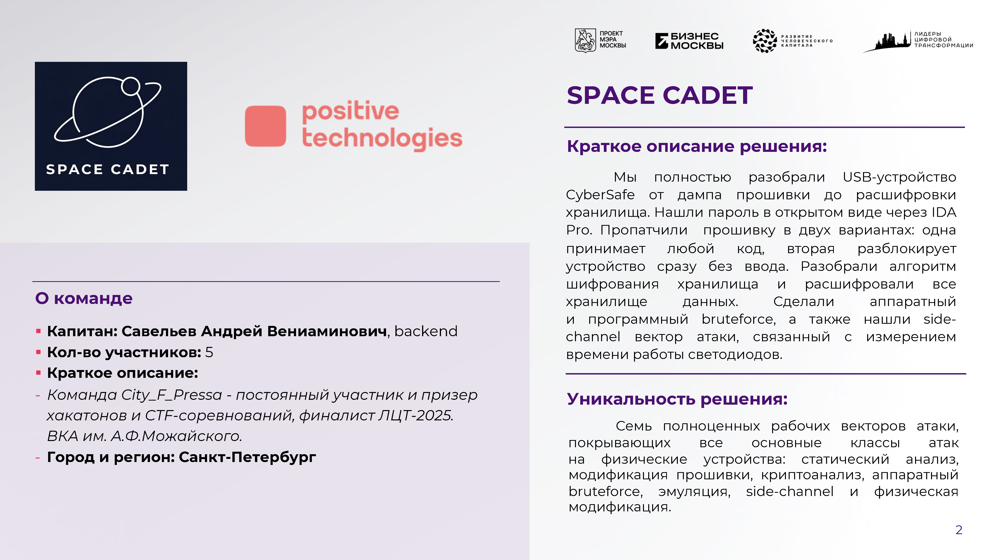
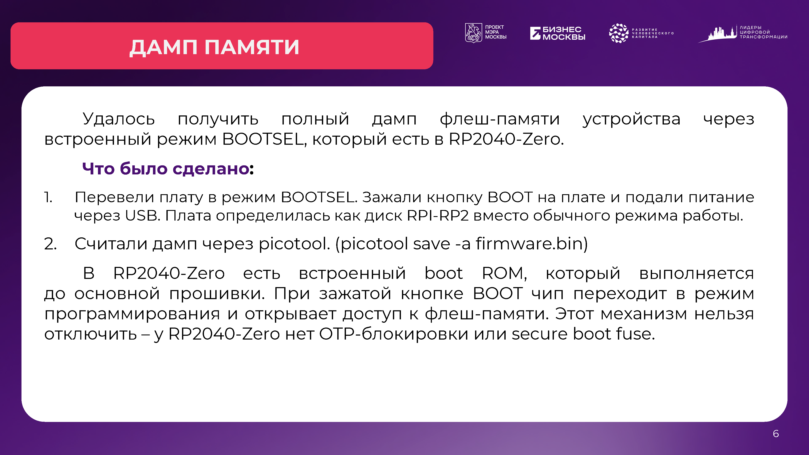
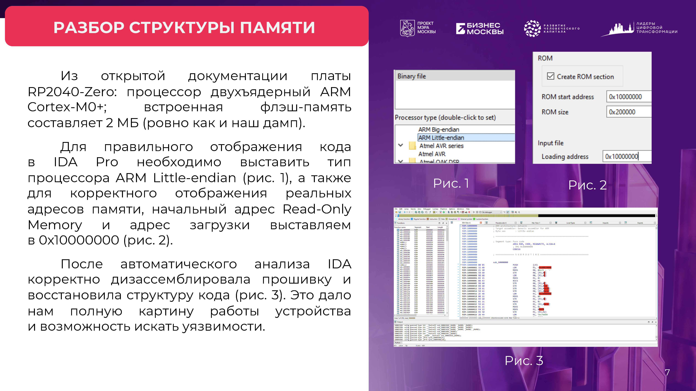
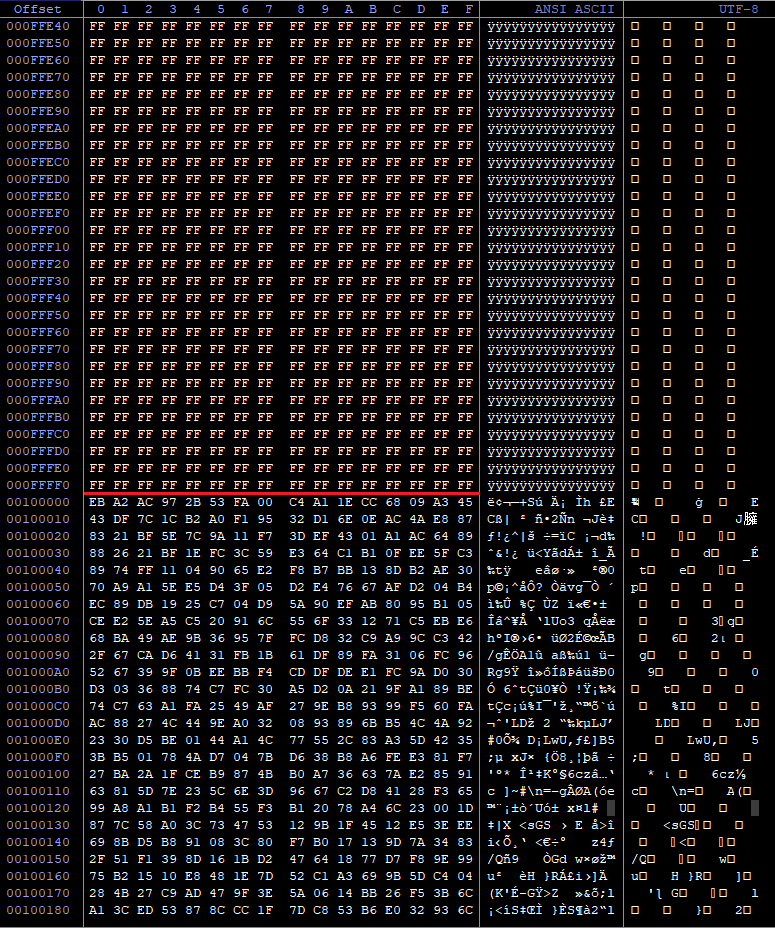
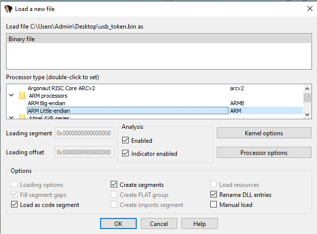
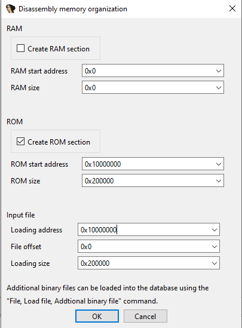
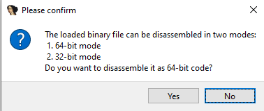
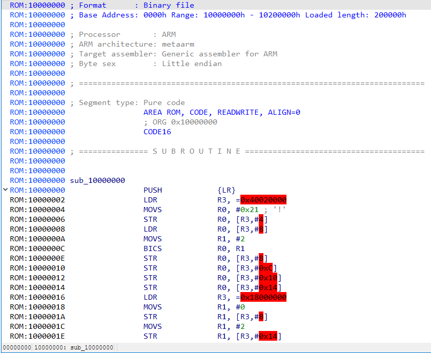

# **SPACE CADET SOLUTION**

- [**SPACE CADET SOLUTION**](#space-cadet-solution)
- [**О команде**](#о-команде)
- [**Краткое описание решения**](#краткое-описание-решения)
- [**Ход решения**](#ход-решения)
  - [**1. Дамп прошивки и статический анализ**](#1-дамп-прошивки-и-статический-анализ)
    - [**1.1. Дамп памяти**](#11-дамп-памяти)
    - [**1.2. Статический анализ**](#12-статический-анализ)

 

# **О команде**

  
  

  
  

 

# **Краткое описание решения**

  

 

# **Ход решения**

## **1. Дамп прошивки и статический анализ**
### **1.1. Дамп памяти**

  

 

- **Суть:**
  - первым шагом нашего исследования было получение полного образа флеш-памяти устройства. Без этого программный анализ был бы невозможен чтобы дизассемблировать код, искать уязвимости и патчить прошивку, нужен был исходный материал, с которым можно работать.
- **Описание:**
  1. устройство построено на плате RP2040-Zero. У этого чипа есть встроенный режим загрузки BOOTSEL. Этот режим активируется при подаче питания с зажатой кнопкой BOOT - чип переходит в состояние программирования и определяется компьютером как USB-накопитель с именем `RPI-RP2`. Мы зажали кнопку BOOT, подключили устройство к компьютеру и дождались появления диска;
  2. после этого мы использовали официальную утилиту `picotool` от Raspberry Pi. Команда `picotool save -a firmware.bin` считывает всё содержимое флеш-памяти в файл. Флаг `-a` означает «all» - сохранить весь объём. В результате мы получили бинарный файл размером 2 мегабайта, который и является полным образом прошивки.
- **Почему это сработало:**
  - в RP2040 есть встроенный загрузчик (boot ROM), который выполняется самым первым при подаче питания. При зажатой кнопке BOOT чип вместо запуска основной прошивки переходит в режим программирования и открывает доступ к флеш-памяти через USB. Этот механизм нельзя отключить - в RP2040 нет ни OTP-блокировки, ни защитного fuse, который запрещал бы чтение через BOOTSEL.
- **Что это дало:**
  - мы получили полный дамп прошивки, пригодный для загрузки в дизассемблер. Это открыло доступ ко всему дальнейшему анализу: поиску пароля, восстановлению логики проверки, изучению алгоритма шифрования хранилища. Кроме того, наличие дампа позволило нам впоследствии патчить прошивку и заливать её обратно;
  - важно отметить, что для этого шага не потребовалось ни паяльника, ни программатора, ни разборки устройства. Достаточно было USB-кабеля и нескольких минут.

 

### **1.2. Статический анализ**

  

 

- **Суть:**
  - после получения дампа нужно было понять, как устроена флеш-память устройства, и правильно загрузить образ в дизассемблер. Без корректных настроек IDA не сможет распознать код - она покажет либо мусор, либо неполную картину. Поэтому этот шаг был критически важен для всего дальнейшего анализа.
**Структура памяти:**
  - флеш-память RP2040-Zero имеет объём 2 мегабайта и организована следующим образом. Первый мегабайт, начиная с адреса `0x10000000`, занимает прошивка - код, который выполняется при включении устройства. Второй мегабайт, начиная с адреса `0x10100000`, отведён под виртуальное хранилище. Это те данные, которые устройство отдаёт по USB после разблокировки - образ файловой системы FAT12 размером ровно 1 мегабайт;
  - такое разделение удалось определить, проанализировав дамп: код прошивки заканчивается в первом мегабайте, а дальше начинается область, содержимое которой после расшифровки даёт сигнатуру загрузочного сектора FAT12.

  

- **Загрузка в IDA Pro:**
  - для корректного дизассемблирования нужно было указать три ключевых параметра при импорте файла;
  - **первое** - *тип процессора*. RP2040-Zero построен на ядре ARM Cortex-M0+, которое относится к архитектуре ARMv6-M. В IDA мы выбрали `ARM Little-endian`, поскольку чип работает таким образом.

    

      
    

  - **второе** - *базовый адрес*. Дамп - это просто набор байтов, и IDA не знает, по какому адресу он находился в памяти. Для RP2040 флеш-память отображается начиная с адреса `0x10000000`. Мы указали именно этот адрес. Если его не задать, все перекрёстные ссылки на функции и данные будут смещены, и дизассемблер не сможет корректно построить граф вызовов.

    

      
    

  - **третье** - *режим инструкций*. Cortex-M0+ работает только в режиме Thumb, который использует 16- и 32-битные инструкции. IDA обычно определяет это автоматически, но мы самостоятельно выставили 32-битный режим.

    

      
    

- **Проверка корректности:**
  - после загрузки мы убедились, что IDA правильно распознала начало прошивки. В самом начале дампа всегда лежит векторная таблица прерываний - служебная структура, через которую процессор понимает, откуда начинать выполнение и где находится стек. Если дизассемблер загружен корректно, эта таблица выглядит осмысленно: указатели ведут в правильные области памяти, а не в произвольные места. Мы проверили это визуально и убедились, что IDA не ошиблась с адресами и архитектурой.

    

      
    

- **Что это дало:**
  - после автоматического анализа IDA корректно дизассемблировала прошивку. Она восстановила векторную таблицу, точку входа, инициализацию периферии и основные функции. Мы получили читаемый код, пригодный для поиска уязвимостей и патчинга. Это стало отправной точкой для всего дальнейшего разбора логики устройства.

 