<table>
  <tr>
    <td width="50%" valign="center">
      
    </td>
    <td width="80%" valign="center">
      

        <h1>SPACE CADET</h1>
        
Команда <b>SPACE CADET</b> - постоянный участник и призер хакатонов и CTF-соревнований, финалист ЛЦТ-2025.

        
ВКА им. А.Ф.Можайского.

        
г. Санкт-Петербуг.

      

    </td>
  </tr>
</table>
  

  <h1>Table of Contents</h1>

  <a href="#about-team">О команде</a> &nbsp;•&nbsp;
  <a href="#summary-solutions">Краткое описание решения</a>

  <b><a href="#solutions">РЕШЕНИЕ</a></b>

  <b><a href="#1-дамп-прошивки-и-статический-анализ">1. Подготовительный этап:</a></b>
   
  <a href="#11-дамп-памяти">Дамп памяти</a> &nbsp;•&nbsp;
  <a href="#12-статический-анализ">Статический анализ</a>

  <b><a href="#2-векторы-атаки">2. Векторы атаки:</a></b>
   
  <a href="#21-извлечение-пароля">Извлечение пароля</a> &nbsp;•&nbsp;
  <a href="#22-модификация-прошивки">Модификация прошивки</a> &nbsp;•&nbsp;
  <a href="#23-криптоанализ-хранилища">Криптоанализ хранилища</a> &nbsp;•&nbsp;
  <a href="#24-эмуляция-функций-прошивки">Эмуляция функций прошивки</a> &nbsp;•&nbsp;
  <a href="#25-аппаратный-перебор">Аппаратный перебор</a> &nbsp;•&nbsp;
  <a href="#26-voltage-fault-injection">Voltage fault injection</a> &nbsp;•&nbsp;
  <a href="#27-side-channel-атака">Side-Channel атака</a> &nbsp;•&nbsp;
  <a href="#28-выпаивание-чипа-памяти">Выпаивание чипа памяти</a>

  <b><a href="#results">ИТОГИ</a></b>

  

  <h1 id="about-team">О команде</h1>

  
  
  
  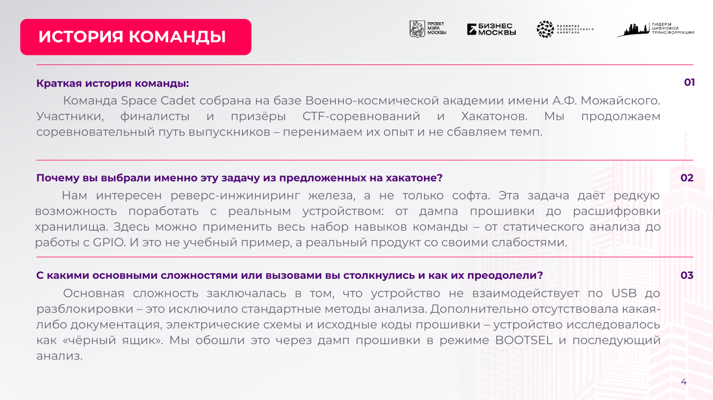

> [!IMPORTANT]
> Наша презентация - [тык-тык](./contents/presentation/Space_Cadet.pptx)
 

  <h1 id="summary-solutions">Краткое описание решения</h1>

  

 

  <h1 id="solutions">РЕШЕНИЕ</h1>

 

## **1. Подготовительный этап**
### **1.1. Дамп памяти**

  

Нажмите, чтобы развернуть

 

<table>
  <tr>
    <td width="50%" valign="center">
      <h2 align="center">Суть</h2>
        
Первым шагом нашего исследования было получение полного образа флеш-памяти устройства. Без этого программный анализ был бы невозможен чтобы дизассемблировать код, искать уязвимости и патчить прошивку, нужен был исходный материал, с которым можно работать.

    </td>
    <td width="50%" valign="center">
      <h2 align="center">Описание:</h2>
      <ul>
        <li>устройство построено на плате RP2040-Zero. У этого чипа есть встроенный режим загрузки BOOTSEL. Этот режим активируется при подаче питания с зажатой кнопкой BOOT - чип переходит в состояние программирования и определяется компьютером как USB-накопитель с именем <code>RPI-RP2</code>. Мы зажали кнопку BOOT, подключили устройство к компьютеру и дождались появления диска;</li>
        <li>после этого мы использовали официальную утилиту <code>picotool</code> от Raspberry Pi. Команда <code>picotool save -a firmware.bin</code> считывает всё содержимое флеш-памяти в файл. Флаг <code>-a</code> означает «all» - сохранить весь объём. В результате мы получили бинарный файл размером 2 мегабайта, который и является полным образом прошивки.</li>
      </ul>
    </td>
  </tr>
</table>

<table>
  <tr>
    <td width="50%" valign="center">
      <h2 align="center">Почему это сработало</h2>
        
В RP2040 есть встроенный загрузчик (boot ROM), который выполняется самым первым при подаче питания. При зажатой кнопке BOOT чип вместо запуска основной прошивки переходит в режим программирования и открывает доступ к флеш-памяти через USB. Этот механизм нельзя отключить - в RP2040 нет ни OTP-блокировки, ни защитного fuse, который запрещал бы чтение через BOOTSEL.

    </td>
    <td width="50%" valign="center">
      <h2 align="center">Что это дало</h2>
      <ul>
        <li>мы получили полный дамп прошивки, пригодный для загрузки в дизассемблер. Это открыло доступ ко всему дальнейшему анализу: поиску пароля, восстановлению логики проверки, изучению алгоритма шифрования хранилища. Кроме того, наличие дампа позволило нам впоследствии патчить прошивку и заливать её обратно;</li>
        <li>важно отметить, что для этого шага не потребовалось ни паяльника, ни программатора, ни разборки устройства. Достаточно было USB-кабеля и нескольких минут.</li>
      </ul>
      

        <a href="https://rutube.ru/video/private/4dd8cba8a8b22da1f1f2a276ad5d3c68/?p=FgWevMKcQQkReNsmG5ebIg">
          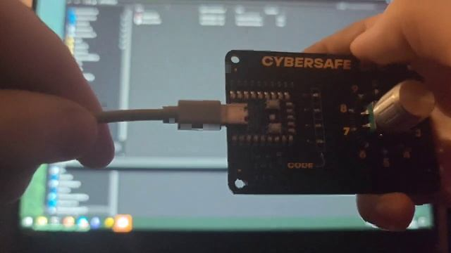
           
          <b>🎬 Смотреть</b>
        </a>
      

    </td>
  </tr>
</table>

 

### **1.2. Статический анализ**

  

Нажмите, чтобы развернуть

 

<table>
  <tr>
    <td width="50%" valign="center">
      <h2 align="center">Суть</h2>
      <ul>
        <li>после получения дампа нужно было понять, как устроена флеш-память устройства, и правильно загрузить образ в дизассемблер. Без корректных настроек IDA не сможет распознать код - она покажет либо мусор, либо неполную картину. Поэтому этот шаг был критически важен для всего дальнейшего анализа.</li>
      </ul>
      <h2 align="center">Структура памяти</h2>
      <ul>
        <li>флеш-память RP2040-Zero имеет объём 2 мегабайта и организована следующим образом. Первый мегабайт, начиная с адреса <code>0x10000000</code>, занимает прошивка - код, который выполняется при включении устройства. Второй мегабайт, начиная с адреса <code>0x10100000</code>, отведён под виртуальное хранилище. Это те данные, которые устройство отдаёт по USB после разблокировки - образ файловой системы FAT12 размером ровно 1 мегабайт;</li>
        <li>такое разделение удалось определить, проанализировав дамп: код прошивки заканчивается в первом мегабайте, а дальше начинается область, содержимое которой после расшифровки даёт сигнатуру загрузочного сектора FAT12.</li>
      </ul>
    </td>
    <td width="50%" valign="center">
      
    </td>
  </tr>
</table>
 

<table>
  <tr>
    <td width="50%" valign="center">
      <h2 align="center">Загрузка в IDA Pro</h2>
      <ul>
        <li>для корректного дизассемблирования нужно было указать три ключевых параметра при импорте файла.</li>
        <li><b>первое</b> - <i>тип процессора</i>. RP2040-Zero построен на ядре ARM Cortex-M0+, которое относится к архитектуре ARMv6-M. В IDA мы выбрали <code>ARM Little-endian</code>, поскольку чип работает таким образом</li>
      </ul>
    </td>
    <td width="50%" valign="center">
      
    </td>
  </tr>
</table>

<table>
  <tr>
    <td width="50%" valign="center">
      <ul>
        <li><b>второе</b> - <i>базовый адрес</i>. Дамп - это просто набор байтов, и IDA не знает, по какому адресу он находился в памяти. Для RP2040 флеш-память отображается начиная с адреса <code>0x10000000</code>. Мы указали именно этот адрес. Если его не задать, все перекрёстные ссылки на функции и данные будут смещены, и дизассемблер не сможет корректно построить граф вызовов.</li>
      </ul>
    </td>
    <td width="50%" valign="center">
      
    </td>
  </tr>
</table>

<table>
  <tr>
    <td width="50%" valign="center">
      <ul>
        <li><b>третье</b> - <i>режим инструкций</i>. Cortex-M0+ работает только в режиме Thumb, который использует 16- и 32-битные инструкции. IDA обычно определяет это автоматически, но мы самостоятельно выставили 32-битный режим.</li>
      </ul>
    </td>
    <td width="50%" valign="center">
      
    </td>
  </tr>
</table>
 

<table>
  <tr>
    <td width="50%" valign="center">
      <h2 align="center">Проверка корректности</h2>
      <ul>
        <li>после загрузки мы убедились, что IDA правильно распознала начало прошивки. В самом начале дампа всегда лежит векторная таблица прерываний - служебная структура, через которую процессор понимает, откуда начинать выполнение и где находится стек. Если дизассемблер загружен корректно, эта таблица выглядит осмысленно: указатели ведут в правильные области памяти, а не в произвольные места. Мы проверили это визуально и убедились, что IDA не ошиблась с адресами и архитектурой.</li>
      </ul>
    </td>
    <td width="50%" valign="center">
      
    </td>
  </tr>
</table>
 

  <table width="50%">
    <tr>
      <td>
        <h1 align="center">Что это дало</h1>
        
После автоматического анализа IDA корректно дизассемблировала прошивку. Она восстановила векторную таблицу, точку входа, инициализацию периферии и основные функции. Мы получили читаемый код, пригодный для поиска уязвимостей и патчинга. Это стало отправной точкой для всего дальнейшего разбора логики устройства.

      </td>
    </tr>
  </table>

   

## **2. Векторы атаки**
### **2.1. Извлечение пароля**

  

Нажмите, чтобы развернуть

 

<table>
  <tr>
    <td width="50%" valign="center">
      <h1 align="center">Суть</h1>
      <ul>
        <li>после загрузки дампа в IDA Pro мы получили читаемый дизассемблированный код. Следующим шагом было найти в этом коде логику проверки пароля и понять, где хранится эталонная комбинация. Это дало бы нам первый способ разблокировки - без перебора и без аппаратного вмешательства.</li>
      </ul>
      <h2 align="center">Как искали</h2>
      <ul>
        <li>мы отталкивались от точки входа и шли по цепочке вызовов. От векторной таблицы перешли к Reset Handler, от него - к основной функции, которая выполняется после инициализации. Внутри неё нашли бесконечный цикл - характерный признак главной функции. По вызовам внутри этого цикла вышли на функцию, которая отвечает за обработку энкодера и ввод цифр;</li>
        <li>эта функция сразу обратила на себя внимание: она работала с GPIO энкодера, управляла светодиодами, хранила введённые цифры в буфер и содержала цикл сравнения с эталоном. Всё указывало на то, что именно здесь происходит проверка пароля.</li>
      </ul>
    </td>
    <td width="50%" valign="center">
      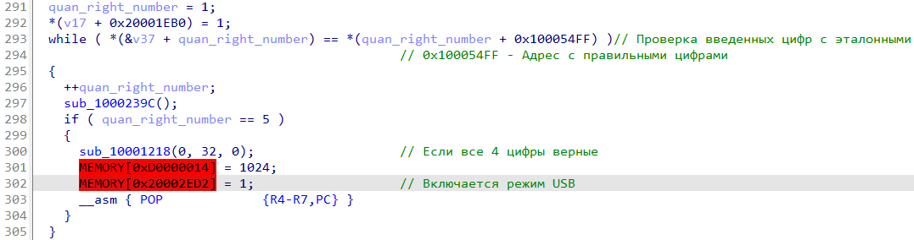
    </td>
  </tr>
</table>
 

<table>
  <tr>
    <td width="50%" valign="center">
      <h2 align="center">Где хранился пароль</h2>
      <ul>
        <li>внутри функции был цикл, который сравнивал введённые цифры с эталонными. По этому адресу лежали четыре цифры в открытом виде. Пароль хранился без обфускации и без шифрования, просто как последовательность байтов. Также видно, что после пароля лежат значения цифр для энкодера. В дальнейшем при аппаратном изучении, уже было понятно, почему этот массив начинается именно с 7, а не с 1.</li>
      </ul>
    </td>
    <td width="50%" valign="center">
      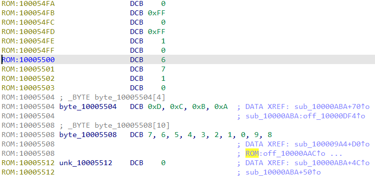
    </td>
  </tr>
</table>

<table>
  <tr>
    <td width="50%" valign="center">
      <h1 align="center">Почему это критично?</h1>
      <ul>
        <li>эталонный пароль лежит в прошивке открытым текстом. Любой, у кого есть дамп флеш-памяти, может прочитать его за секунды - без перебора, без знания устройства, без каких-либо специальных инструментов. Достаточно открыть дамп в hex-редакторе и посмотреть на нужное смещение;</li>
        <li>Это полностью обесценивает парольную защиту. Четырёхзначный код перестаёт быть секретом в тот момент, когда прошивка оказывается на руках. А получить её можно через BOOTSEL - то есть при физическом доступе к устройству, что и является моделью угрозы для подобных устройств.</li>
      </ul>
    </td>
  </tr>
</table>

  <table width="50%">
    <tr>
      <td>
        <h1 align="center">Что это дало</h1>
        
Мы получили пароль в открытом виде и подтвердили, что проверка устроена тривиально - сравнение введённых цифр с константой. Это дало нам первый рабочий способ разблокировки и понимание логики, которое пригодилось для дальнейшего патчинга.

        

          <a href="https://rutube.ru/video/private/bdd4f79ffc7ca87fc9505f549b628c69/?p=i3k3vOKN9lZWjNGD_pFlng">
            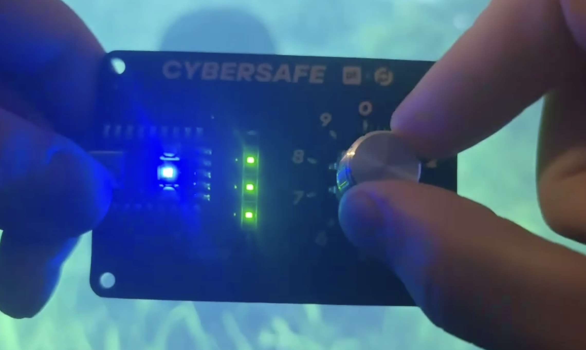
             
            <b>🎬 Смотреть</b>
          </a>
        

      </td>
    </tr>
  </table>

 

### **2.2. Модификация прошивки**

  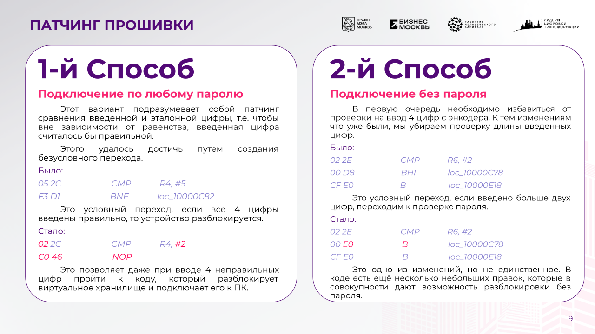

Нажмите, чтобы развернуть

 

<table>
  <tr>
    <td width="50%" valign="center">
      <h1 align="center">Суть</h1>
      
Получив дамп прошивки и разобравшись в логике проверки пароля, мы перешли к модификации. Цель была двойная: во-первых, заставить устройство принимать любой пароль, во-вторых - научить его разблокироваться вообще без ввода. Оба результата достигаются патчингом нескольких инструкций в прошивке.

    </td>
    <td width="50%" valign="center">
      <h2 align="center">Подготовка</h2>
      <ui>
        <li>работа велась с бинарным дампом, полученным через BOOTSEL. Мы открыли его в hex-редакторе WinHex и нашли места для правок, ориентируясь на адреса из IDA Pro. Патч вносился вручную - менялись конкретные байты, соответствующие нужным инструкциям;</li>
        <li>после правок пропатченный файл конвертировался в формат `.uf2` и заливался на плату. Для этого плата переводилась в режим BOOTSEL, после чего файл просто копировался на появившийся диск.</li>
      <ui>
    </td>
  </tr>
</table>
 

<table>
  <tr>
    <td width="45%" valign="center">
      <h1 align="center">Первый способ: любой пароль</h1>
      
Идея этого варианта - отключить проверку введенной цифры с эталонной. В оригинале устройство сравнивает все четыре цифры и только в случае совпадения всех 4 цифр разблокируется. Мы сделали так, чтобы проверка проходила вне зависимости от 4 введенных цифр и устройство разблокировалась.

    </td>
    <td width="45%" valign="center">
      <h2 align="center">В коде это выглядело так. До патча:</h2>
      <pre><code>
ROM:10000C96 05 2C          CMP     R4, #5
ROM:10000C98 F3 D1          BNE     loc_10000C82
      </code></pre>
      <h2 align="center">После патча:</h2>
      <pre><code>
ROM:10000C96 02 2C          CMP     R4, #2
ROM:10000C98 C0 46          NOP
      </code></pre>
      
Инструкция условного перехода заменена на пустую операцию, а сравнение - на другое число, для того, чтобы неправильные цифры также проходили. В результате цикл проверки больше не повторяется, и устройство переходит к блоку разблокировки.

    </td>
  </tr>
</table>

  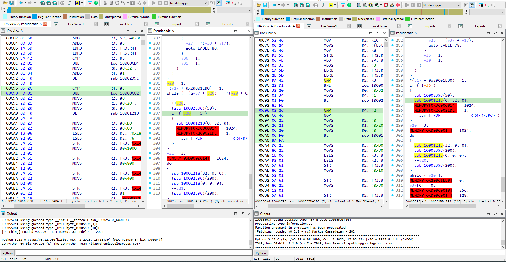

 

<table>
  <tr>
    <td width="45%" valign="center">
      <h1 align="center">Второй способ: без пароля</h1>
      
Этот вариант идёт дальше первого. Если первый способ позволял пройти проверку путем ввода любого пароля, то здесь мы убрали необходимость ввода как такового. Устройство разблокируется сразу при включении, без единого действия с энкодером.

    </td>
    <td width="45%" valign="center">
      <h2 align="center">Первое изменение: убираем проверку длины</h2>
      
В оригинале устройство проверяет, сколько цифр введено, и только после этого переходит к сравнению. Нам нужно было избавиться от этого условия, чтобы проверка запускалась сразу.

      <h2 align="center">В коде это выглядело так. До патча:</h2>
      <pre><code>
02 2E          CMP     R6, #2
00 D8          BHI     loc_10000C78
CF E0          B       loc_10000E18
      </code></pre>
      
Это условный переход: если введено больше двух цифр, управление идёт к проверке пароля. Иначе - на обработку следующей цифры.

      <h2 align="center">После патча:</h2>
      <pre><code>
02 2E          CMP     R6, #2
00 E0          B       loc_10000C78
CF E0          B       loc_10000E18
      </code></pre>
      
Условный переход заменён на безусловный. Теперь управление <b>всегда</b> уходит к проверке пароля, независимо от того, сколько цифр введено. Это одно из изменений, но не единственное.

    <h2 align="center">Второе изменение: эмулируем нажатие кнопки</h2>
      
Даже с отключённой проверкой длины устройство всё ещё ждёт, пока пользователь нажмёт кнопку - есть внутренний флаг, который сигнализирует «кнопка была нажата, можно обрабатывать». В нормальном режиме этот флаг сбрасывается при инициализации, и устройство ждёт действия пользователя. Мы сделали так, чтобы этот флаг был установлен сразу при старте - как будто пользователь уже нажал кнопку ещё до того, как устройство начало работу.

      <h2 align="center">Технически это замена одной инструкции:</h2>
      <pre><code>
Было:   STRB R7, [R3]     
Стало:  STRB R2, [R3]
      </code></pre>
    </td>
  </tr>
</table>
 

<table>
  <tr>
    <td width="50%" valign="center">
      <h2 align="center">Как это работает вместе</h2>
      
Первое изменение убирает необходимость вводить все четыре цифры. Второе - убирает необходимость нажимать кнопку. В сумме устройство проходит всю цепочку проверки, не требуя от пользователя ничего: при подаче питания оно считает, что цифры уже введены, кнопка нажата, и сразу открывает хранилище. В коде есть ещё несколько небольших правок, которые в совокупности дают этот эффект.

    </td>
    <td width="50%" valign="center">
      <h2 align="center">Как проверяли</h2>
      
После заливки пропатченной прошивки устройство подключили к компьютеру. В нормальном режиме оно определяется как USB-накопитель только после ввода пароля. В нашем случае хранилище появилось в системе сразу - без вращения энкодера, без нажатий, без каких-либо действий. Это подтвердило, что оба патча работают в связке.

    </td>
  </tr>
</table>
 

  <table width="50%">
    <tr>
      <td>
        <h1 align="center">Почему это важно</h1>
        
Этот способ показывает, что защита устройства держится не на криптографии и не на аппаратных барьерах, а на нескольких переменных в оперативной памяти. Достаточно изменить пару инструкций, чтобы устройство повело себя так, будто пароль уже введён. Для жюри это хороший пример того, насколько хрупкой может быть логическая защита, если она не подкреплена аппаратными механизмами.

      </td>
    </tr>
  </table>

 

<h1 align="center">Итог</h1>
<ui>
  <li>стоит отметить, что перепрошивка устройства - это творческий процесс. Мы показали два конкретных способа обхода, но на самом деле их может быть гораздо больше. Достаточно понимать логику работы прошивки, чтобы менять поведение устройства как угодно: убирать проверки, добавлять свои условия, менять реакцию на ввод. Главное - иметь дамп и инструмент для заливки. Всё остальное ограничивается только фантазией и пониманием кода;</li>
  <li>обе пропатченные прошивки приложены в репозиторий - каждая в формате .bin, готовая к загрузке. Первая принимает любой пароль, вторая разблокирует устройство без ввода. Любой может проверить их самостоятельно, залив на плату теми же способами, которые мы использовали;</li>
  <li>загрузить прошивку на устройство можно с помощью picotool из командной строки: плата переводится в режим BOOTSEL, после чего выполняется команда, которая заливает образ и сразу перезапускает устройство:
      
    <table>
      <tr>
        <td width="50%" valign="center">
          <pre><code>
      picotool load -x any_pass.bin -t bin -o 0x10000000
          </code></pre>
        </td>
        <td width="50%" valign="center">
          

            <a href="https://rutube.ru/video/private/06381f8e61f19962c13714f6db42c98d/?p=Ay7jJa4Pyu-8db1phFyHMQ">
              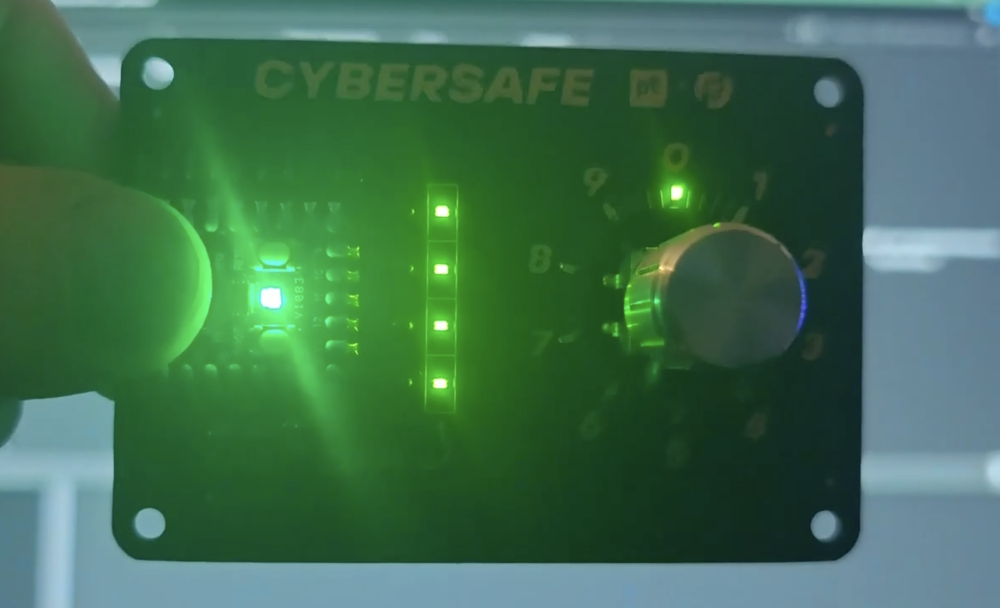
               
              <b>🎬 Смотреть</b>
            </a>
          

        </td>
      </tr>
    </table>
</ui>

> [!IMPORTANT]
> - Прошивка без пароля - [тык-тык](./patching_src/no_pass.bin)
> - Прошивка, принимающая любой пароль - [тык-тык](./patching_src/any_pass.bin)

 

### **2.3. Криптоанализ хранилища**

  

Нажмите, чтобы развернуть

 

<table>
  <tr>
    <td width="50%" valign="center">
      <h1 align="center">Суть</h1>
      
После того как мы разобрали логику проверки пароля и научились патчить прошивку, оставался главный вопрос: как получить доступ к самим данным. Виртуальное хранилище, которое устройство отдаёт по USB, хранится во флеш-памяти в зашифрованном виде. Нам нужно было понять алгоритм и восстановить исходные данные из дампа - без устройства и без пароля.

    </td>
    <td width="50%" valign="center">
      <h1 align="center">Как искали функции шифрования</h1>
      <ui>
        <li>мы отталкивались от цепочки вызовов. В главной функции устройства есть бесконечный цикл, который обрабатывает USB-события. Внутри этого цикла вызывается обработчик SCSI-команд - именно он отвечает за чтение и запись секторов хранилища. От него мы перешли к двум функциям, которые и выполняют шифрование: одна работает при чтении, другая при записи;</li>
        <li>внутри этих функций сразу было видно характерное: цикл по шестнадцатибайтовым блокам, XOR-операции с константами и генератор, зависящий от номера сектора. Всё указывало на потоковый шифр на основе XOR.</li>
      </ui>
      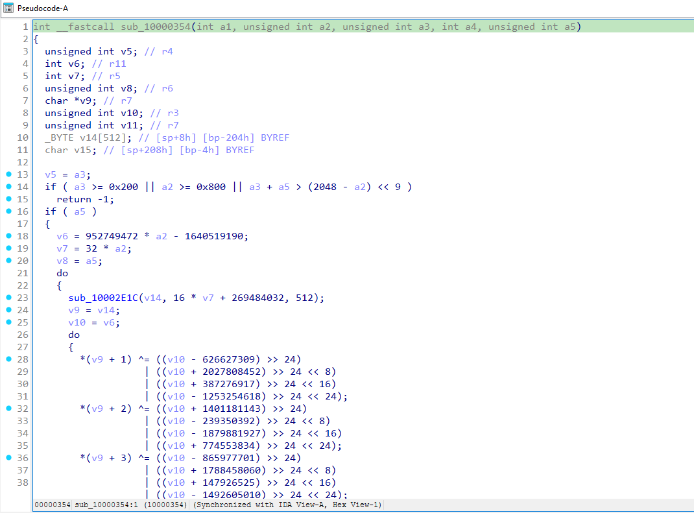
    </td>
  </tr>
</table>

<table>
  <tr>
    <td width="50%" valign="center">
      <h1 align="center">Как поняли, что это XOR</h1>
      
Ключевой признак - операция исключающего ИЛИ. В коде каждый байт данных XOR-ится с байтом ключа, который генерируется на лету. Поскольку XOR - обратимый процесс, одна и та же операция работает и для шифрования, и для дешифрования. Это подтверждалось и структурой кода: обе функции - чтения и записи - реализуют один и тот же алгоритм, отличаются только точкой вызова.

    </td>
    <td width="50%" valign="center">
      <h1 align="center">Как восстановили ключ</h1>
      <ui>
        <li>ключ генерируется линейным конгруэнтным генератором, начальное значение которого зависит от номера сектора. Это значит, что для каждого сектора ключ свой, но вычисляется он детерминированно - зная номер сектора, можно воспроизвести ключ. Мы разобрали формулу генератора, извлекли шестнадцать констант, по одной на каждый байт в блоке, и собрали их в таблицу;</li>
        <li>важный момент: ключ зависит <b>только от номера сектора</b>. Пароль в генерации ключа не участвует. Это означает, что шифрование хранилища не связано с парольной защитой - пароль лишь управляет тем, отдаёт ли устройство данные по USB.</li>
      </ui>
    </td>
  </tr>
</table>

  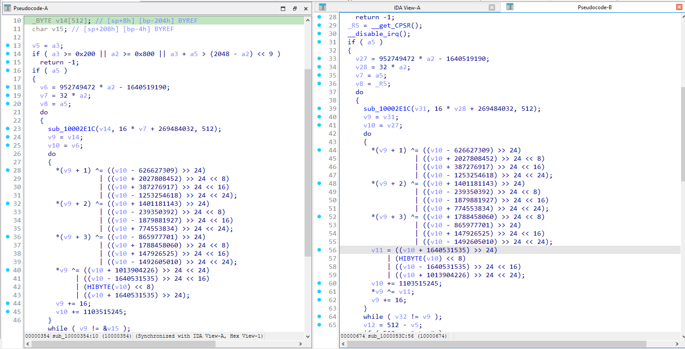

  <h1>Генерация ключа</h1>

<table>
  <tr>
    <td width="50%" valign="center">
      <h1 align="center">Алгоритм генерации ключа</h1>
      
Ключ генерируется для каждого сектора отдельно. Начальное значение счётчика зависит от номера сектора и вычисляется по формуле:
         
        <pre><code>seed = (952749472 * lba - 1640519190) mod 2^32</code></pre>
        Каждый сектор разбивается на 32 блока по 16 байт. Для каждого блока генерируется свой набор из 16 байт ключа. Байт с номером <code>i</code> в блоке вычисляется как:
         
        <pre><code>key[i] = ((v10 + C[i]) mod 2^32) >> 24</code></pre>
        где <code>v10</code> - текущее значение счётчика, а <code>C[i]</code> - константа для этого байта. После генерации блока счётчик увеличивается на <code>1103515245</code>:
         
        <pre><code>v10 = (v10 + 1103515245) mod 2^32</code></pre>
      

       
      <h1 align="center">Пример для нулевого сектора</h1>
      
Для <code>lba = 0</code> начальное значение счётчика равно <code>-1640519190</code> (в hex - <code>0x9E37A9EA</code>). Первый блок ключа получается таким:
       
      <pre><code>00 9E 3C DA 78 17 B5 53 F1 8F 2E CC 6A 08 A7 45</code></pre>
      Этот ключ подтверждён на реальных данных - XOR с ним даёт корректный загрузочный сектор FAT12.

    </td>
    <td width="50%" valign="center">
      <h1 align="center">Таблица констант</h1>
      <table align="center">
        <tr>
          <td width="50%" valign="center">
            <h2 align="center">Смещение</h2>
            
0

            
1

            
2

            
3

            
4

            
5

            
6

            
7

            
8

            
9

            
10

            
11

            
12

            
13

            
14

            
15

          </td>
          <td width="50%" valign="center">
            <h2 align="center">Константа</h2>
            
1640531535

            
0

            
-1640531535

            
1013904226

            
-626627309

            
2027808452

            
387276917

            
-1253254618

            
1401181143

            
-239350392

            
-1879881927

            
774553834

            
-865977701

            
1788458060

            
147926525

            
-1492605010

          </td>
        </tr>
      </table>
    </td>
  </tr>
</table>

<table>
  <tr>
    <td width="50%" valign="center">
      <h1 align="center">Как написан скрипт</h1>
      <ui>
        <li>ключевой признак - операция исключающего ИЛИ. В коде каждый байт данных XOR-ится с байтом ключа, который генерируется на лету. Поскольку XOR - обратимый процесс, одна и та же операция работает и для шифрования, и для дешифрования. Это подтверждалось и структурой кода: обе функции - чтения и записи - реализуют один и тот же алгоритм, отличаются только точкой вызова;</li>
        <li>скрипт состоит из нескольких частей:
          <ol>
            <li>функция генерации ключа для блока;</li>
            <li>функция обработки сектора;</li>
            <li>функция прохода по всему образу.</li>
          </ol>
          
Всё вместе занимает немного строк и работает быстро.

        </li>
      </ui>
    </td>
    <td width="50%" valign="center">
      <h1 align="center">Как проверили результат</h1>
      
После расшифровки мы открыли полученный образ в hex-редакторе. Первые байты начинались с сигнатуры FAT12 - это стандартный загрузочный сектор файловой системы. Значит, алгоритм восстановлен верно, и данные расшифрованы корректно.

      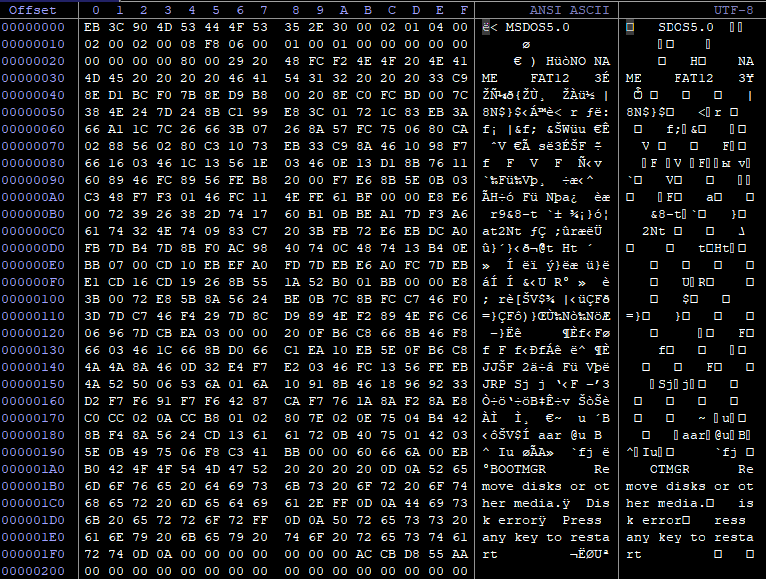
    </td>
  </tr>
</table>

<table>
  <tr>
    <td width="50%" valign="center">
      <h1 align="center">Что это дало</h1>
      
Мы получили полный доступ к содержимому виртуального хранилища - без устройства, без пароля, только из дампа флеш-памяти. Это подтвердило главный вывод: парольная защита и шифрование хранилища существуют независимо друг от друга, и обход пароля не требуется для доступа к данным, если есть дамп.

    </td>
    <td width="50%" valign="center">
      <h1 align="center">Итог</h1>
      <ui>
        <li>в репозиторий приложены оба файла: исходный дамп флеш-памяти и уже расшифрованный образ хранилища. Первый можно использовать для самостоятельного анализа, второй - для проверки результатов или работы с содержимым без повторной расшифровки;</li>
        <li>для запуска скрипта расшифровки используется следующая команда:</li>
        <pre><code>python decrypt.py firmware.bin firmware_decrypt.zip</code></pre>
        
где первый аргумент - путь к дампу прошивки, второй - имя файла, куда будет сохранён расшифрованный образ. Скрипт автоматически определит регион хранилища и обработает все секторы.

      </ui>
    </td>
  </tr>
</table>

> [!IMPORTANT]
> - Исходная прошивка - [тык-тык](./cryptoanalys_src/firmware.bin)
> - Расшифрованный образ хранилища - [тык-тык](./cryptoanalys_src/firmware_decryprt.zip)
> - Скрипт для расшифровки хранилища - [тык-тык](./cryptoanalys_src/decrypt.py)

 

### **2.4. Эмуляция функций прошивки**

  

Нажмите, чтобы развернуть

 

<table>
  <tr>
    <td width="50%" valign="center">
      <h1 align="center">Суть</h1>
      <ui>
        <li>получив дамп оригинальной прошивки, мы решили проверить, насколько далеко можно продвинуться без физического устройства. Основная идея заключалась в том, чтобы не переписывать логику проверки PIN и расшифровки хранилища самостоятельно, а запустить оригинальный машинный код прошивки в эмуляторе;</li>
        <li>для этого была создана программная модель необходимого окружения RP2040 на базе Unicorn Engine. В неё загрузили дамп Flash, выделили области RAM, добавили обработку обращений к периферии и реализовали минимальную эмуляцию SPI Flash. После этого стало возможно запускать отдельные функции оригинальной прошивки непосредственно в эмуляторе;</li>
        <li>в результате через эмулятор удалось выполнить два ключевых действия: перебрать PIN с использованием оригинальной функции его проверки и запустить оригинальную функцию расшифровки содержимого хранилища.</li>
      </ui>
    </td>
    <td width="50%" valign="center">
      <h1 align="center">Подготовка</h1>
      
Работа велась с бинарным дампом Flash, полученным ранее через BOOTSEL. Для запуска прошивки в Unicorn необходимо было восстановить не только сам ARM-код, но и окружение, с которым он взаимодействует во время работы.

      
В скрипте были выделены области Flash и RAM, после чего в них загружалось содержимое дампа. Для прошивки использовался режим ARM Thumb, соответствующий коду микроконтроллера. Дополнительно были отображены области адресного пространства, используемые периферийными блоками RP2040.

      
Часть обращений к аппаратным регистрам нельзя было просто оставить без обработки. Поэтому для них были добавлены hooks Unicorn: при чтении определённых адресов эмулятор возвращает значения, которые прошивка ожидает получить от таймеров, PLL, генераторов тактовой частоты, SIO и других блоков. Аналогичным образом была реализована минимальная модель SPI Flash, позволяющая прошивке получать данные из исходного образа.

      
Таким образом, задача заключалась не в полной эмуляции RP2040, а в восстановлении именно той части аппаратного окружения, которая необходима для выполнения интересующих нас функций.

    </td>
  </tr>
</table>

<table>
  <tr>
    <td width="50%" valign="center">
      <h1 align="center">Запуск оригинальной прошивки</h1>
        
После подготовки памяти и периферии скрипт выполняет начальную инициализацию прошивки. Дополнительно эмулируются некоторые действия bootrom, необходимые для нормальной работы кода: перенос <code>.data</code> в RAM и разрешение используемых ROM-функций.

        
Некоторые инструкции и циклы, связанные непосредственно с аппаратным окружением, пришлось нейтрализовать. Например, в прошивке присутствуют циклы ожидания готовности аппаратных блоков и инструкции работы с <code>PRIMASK</code>, которые Unicorn не может корректно обработать в используемом режиме. Такие участки заменяются на NOP либо получают заранее заданные значения через hooks.

        
После этого прошивка может выполняться в эмуляторе до перехода в рабочее состояние.

    </td>
    <td width="50%" valign="center">
      <h1 align="center">Проверка PIN</h1>
      
Следующим этапом мы перешли непосредственно к функции проверки PIN. При анализе прошивки была найдена соответствующая функция по адресу <code>0x0C78</code>. В скрипте этот адрес используется как точка входа, поэтому для проверки не пришлось воспроизводить алгоритм сравнения на Python.

      
Идея заключается в следующем. Для очередного кандидата формируются четыре цифры:

      <pre><code>
      0000
      0001
      0002
      ...
      9999
      </code></pre>
      
Полученные четыре байта записываются в ту область памяти, из которой оригинальная функция ожидает получить введённый PIN. После этого управление передаётся непосредственно на адрес <code>0x0C78</code>.

      
Для определения результата используются адреса переходов внутри функции проверки. При попадании на ветку успешного завершения эмуляция останавливается, после чего дополнительно проверяется флаг авторизации в памяти. Если его значение равно <code>1</code>, текущая комбинация считается найденным PIN.

      
Важный момент заключается в том, что здесь не реализовывалась отдельная копия алгоритма проверки. Эмулятор запускает именно функцию из исходного дампа, поэтому результат зависит от поведения оригинальной прошивки.

    </td>
  </tr>
</table>

<table>
  <tr>
    <td width="50%" valign="center">
      <h1 align="center">Почему это сработало</h1>
        
Функция использовала данные из памяти и выполняла обычные операции сравнения, поэтому необходимые входные значения можно было подать непосредственно через память эмулятора.

        
Аппаратные компоненты, которые действительно требовались прошивке, были заменены минимальными моделями и hooks. В результате функция проверки смогла выполниться в программной среде так, как если бы она получила данные от настоящего устройства.

        
Таким образом, физический ввод через энкодер оказался необязательным именно для этого этапа анализа.

    </td>
    <td width="50%" valign="center">
      <h1 align="center">Запуск функции расшифровки</h1>
      
После получения возможности выполнять оригинальный код прошивки мы применили тот же подход к хранилищу. В прошивке была найдена функция расшифровки по адресу <code>0x354</code>.

      
Вместо самостоятельной реализации алгоритма расшифровки скрипт подготавливает регистры и стек в соответствии с ожидаемым интерфейсом функции, после чего передаёт управление непосредственно на <code>0x10000354</code>.

      
В <code>R1</code> передаётся номер сектора, в <code>R3</code> — адрес буфера назначения, а на стеке размещается размер обрабатываемых данных. После выполнения функции полученные данные считываются из RAM эмулятора.

    </td>
  </tr>
</table>

<table>
  <tr>
    <td width="50%" valign="center">
      <h1 align="center">Восстановление хранилища</h1>
        
После расшифровки отдельных секторов из них собирается единый образ диска размером 1 МБ. Скрипт обрабатывает 1408 секторов зашифрованной области и записывает результат в файл.

        
Дополнительно перед созданием полного образа выполняется проверка первого сектора. Полученные данные должны соответствовать структуре FAT12: в начале ожидается сигнатура загрузочного сектора <code>MSDOS5.0</code>, а в соответствующем поле — строка <code>FAT12</code>.

        
Таким образом, результат расшифровки проверяется не только по факту выполнения функции, но и по структуре полученной файловой системы.

    </td>
    <td width="50%" valign="center">
      <h1 align="center">Как проверяли</h1>
      
После запуска скрипта сначала проверяется сам дамп прошивки. Скрипт ищет сигнатуру функции проверки PIN, проверяет адреса используемых данных и наличие констант, связанных с алгоритмом расшифровки.

      
После этого создаётся экземпляр эмулятора, выполняется инициализация прошивки и запускается перебор PIN через оригинальную функцию.

      
После нахождения PIN запускается функция расшифровки. Первый расшифрованный сектор проверяется на соответствие FAT12, после чего создаётся полный образ <code>token_disk.img</code>.

      
Полученный образ можно подключить как виртуальный диск и работать с восстановленным содержимым хранилища уже без выполнения кода на самом устройстве.

    </td>
  </tr>
</table>

<table>
  <tr>
    <td width="50%" valign="center">
      <h1 align="center">Как это работает вместе</h1>
        
Весь вектор можно представить как последовательную цепочку:

        <pre><code>
        main()
        │
        ├─ читаем firmware.bin
        │
        ├─ validate_firmware()
        │
        ├─ Token(img)
        │    │
        │    ├─ создаёт Unicorn
        │    ├─ map flash/RAM/MMIO
        │    ├─ ставит hooks
        │    ├─ патчит проблемные инструкции
        │    ├─ эмулирует BootROM
        │    └─ эмулирует SPI
        │
        ├─ boot()
        │
        ├─ crack_pin()
        │
        ├─ setup_emu_decrypt()
        │
        ├─ emu_decrypt_sector()
        │      └─ вызывается для каждого сектора
        │
        ├─ build_disk_emu()
        │
        └─ hdiutil attach
        </code></pre>
    </td>
    <td width="50%" valign="center">
      <h1 align="center">Почему это важно</h1>
      
Этот вектор показывает, что наличие физического устройства не всегда является обязательным условием для анализа защищённой функциональности. Если критичная логика реализована непосредственно в прошивке и не зависит от уникального состояния внешних аппаратных компонентов, её отдельные участки можно выполнять в восстановленной программной среде.

      <h1 align="center">Итог</h1>
      
В результате был создан программный эмулятор необходимой части окружения прошивки RP2040 на базе Unicorn Engine. Он позволяет загружать исходный дамп, выполнять оригинальный ARM-код и моделировать необходимые обращения к аппаратным компонентам.

    </td>
  </tr>
</table>

> [!IMPORTANT]
> Эмулирование прошивки - [тык-тык](./emulation_src).
> 
> Для запуска необходимо создать виртуальное окружение, установить необходимые [зависимости](./requirements.txt) и запустить [main.py](./emulation_src/main.py).

 

### **2.5. Аппаратный перебор**

  

Нажмите, чтобы развернуть

 

<table>
  <tr>
    <td width="50%" valign="center">
      <h1 align="center">Суть</h1>
        
Один из ключевых векторов - это прямой перебор PIN-кода. В прошивке нет никакой защиты от повторных попыток: нет счётчика неудачных вводов, нет блокировки после N ошибок, нет задержки между попытками. Устройство после каждого неверного кода просто сбрасывает ввод. Это делает перебор 10 000 комбинаций полностью реализуемым - вопрос только во времени. Мы автоматизировали процесс через второй микроконтроллер, который эмулирует энкодер, и добавили приоритетный словарь с дефолтными кодами, чтобы не ждать полного перебора.

    </td>
    <td width="50%" valign="center">
      <h1 align="center">Как именно</h1>
        <h2>1. Подготовка</h2>
        
Взяли второй RP2040 (Pico) как атакующее устройство. Подключили его к линиям энкодера цели (GPIO 27 и 28) через джамперы. Подали питание.

        

          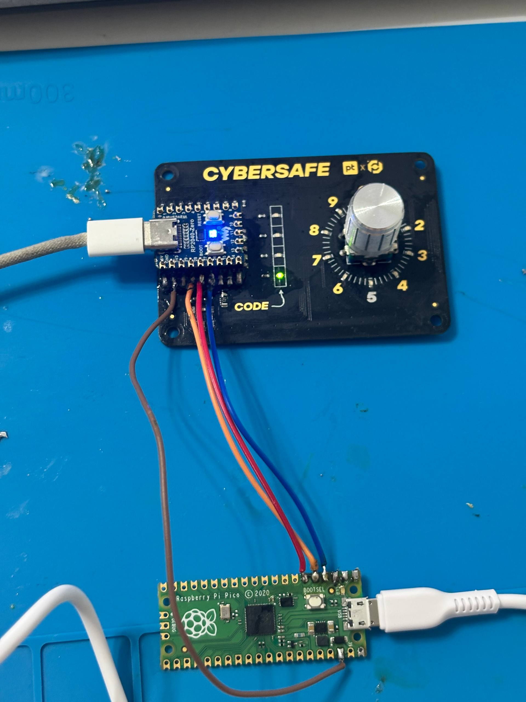
        

        <h2>2. Первая попытка и потеря платы</h2>
        
При первой инициализации GPIO плата на поставленном устройстве вышла из строя. Причина скорее всего в просадке по питанию или обратный ток со стороны контроллера замка. Плата восстановлению не подлежала. Это подтвердило, что при подключении к чужому устройству нужно учитывать разницу потенциалов и защиту по питанию.

        <h2>3. Замена платы</h2>
        
Пришлось купить идентичную плату и установить оригинальную прошивку с измененным PIN-кодом на "0007" для ускорения демонстрации работы процесса перебора. Её разместили поверх повреждённой платы и соединили нужные пины (VCC, GND, DATA) обычными штырьками. Контакт получился надёжным, а конструкция монолитной.

        <h2>4. Тестирование</h2>
        
Далее проверили стенд и получилось подобрать простой код. Ввели код 0007 через эмуляцию энкодера вторым микроконтроллером - устройство разблокировалось, хранилище стало доступно. Подтвердили, что отсутствие блокировки после неудачных попыток делает полный перебор 10 000 комбинаций реализуемым.

        

          <a href="https://rutube.ru/video/private/c26b4834babc39a538ad45b2c2c73ba4/?p=6iQWGuJOSmg_RCFjQgz-BA">
            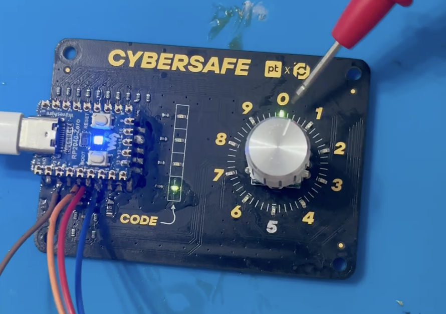
             
            <b>🎬 Смотреть</b>
          </a>
          
Видно как сначала пробуются коды от 0000, 0001 и т.д., а на 0007 плата подключается к ПК.

        

    </td>
  </tr>
</table>

<h1 align="center">Итог</h1>
  
Это аппаратный bruteforce, не требующий разборки устройства или чтения прошивки. Достаточно физического доступа к линиям энкодера.

 

### **2.6. Voltage fault injection**

  

Нажмите, чтобы развернуть

 

<table>
  <tr>
    <td width="50%" valign="center">
      <h1 align="center">Суть</h1>
        
Попытались обойти проверку пароля на уровне микроконтроллера через атаку по питанию. Идея в том, чтобы кратковременно замыкать линию 3.3 В на землю в момент выполнения инструкции сравнения. Если попасть в нужный такт, процессор из-за нехватки напряжения может пропустить эту инструкцию и принять неверный пароль за верный.

    </td>
    <td width="50%" valign="center">
      <h1 align="center">Теория</h1>
      
В отличие от классических glitch-атак, где атакующее устройство отделено от цели, здесь архитектура замкнута. Микроконтроллер сам проверяет пароль, и он же генерирует глитч. Суть метода - намеренно вызвать кратковременную просадку напряжения (brownout) на линии 3.3 В. Если попасть в такт, когда процессор выполняет инструкцию сравнения, из-за нехватки напряжения он может пропустить эту инструкцию или интерпретировать её как истинную, даже если пароль неверный.

    </td>
  </tr>
</table>

<table>
  <tr>
    <td width="50%" valign="center">
      <h1 align="center">Сборка стенда</h1>
        
Для реализации собрали схему crowbar-атаки. MOSFET должен открываться на доли микросекунды, замыкая 3.3 В на землю, и сразу закрываться.

        

          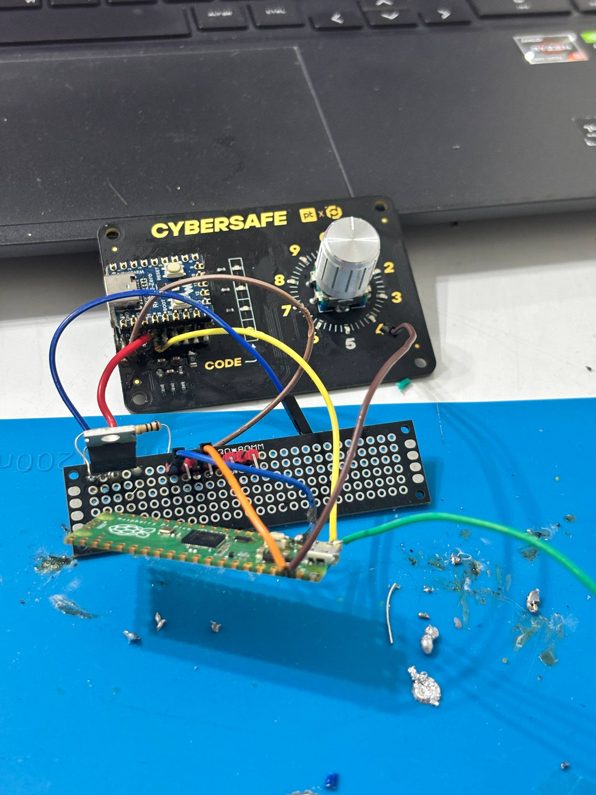
        

    </td>
    <td width="50%" valign="center">
      <h3 align="center">Компоненты</h3>
        <ui>
          <li><b>MOSFET:</b> IRLZ44N. N-канальный, logic-level, способен выдержать импульсный ток короткого замыкания.</li>
          <li><b>Резистор R1 (Gate Series):</b> 100 Ом. Ограничивает ток с GPIO на затвор, предотвращает звон и защищает пин микроконтроллера.</li>
          <li><b>Резистор R2 (Gate Pull-Down):</b> 10 кОм. Притягивает затвор к земле, чтобы MOSFET гарантированно не открылся случайно во время загрузки или перезагрузки.</li>
        </ui>
      <h3 align="center">Схема подключения</h3>
        <ui>
          <li><b>Source (Исток):</b> на GND.</li>
          <li><b>Drain (Сток):</b> на линию 3.3 В цели.</li>
          <li><b>Gate (Затвор):</b> через резистор 100 Ом на GPIO атакующей платы. Резистор 10 кОм идёт от Gate к GND.</li>
        </ui>
    </td>
  </tr>
</table>

<table>
  <tr>
    <td width="50%" valign="center">
      <h1 align="center">Софт и синхронизация</h1>
        
Главная сложность - тайминг. Нужно глитчить строго в момент выполнения инструкции проверки пароля. Написали кастомную прошивку для Pico, которая эмулирует вращение энкодера и нажатие кнопки, дожидается момента, когда контроллер должен перейти к сравнению, и подаёт короткий импульс на затвор MOSFET.

    </td>
    <td width="50%" valign="center">
      <h1 align="center">Итог</h1>
      
Окно глитча нашли, но оно оказалось слишком широким. Вместо пропуска одной инструкции мы вызывали полный сбой логики и перезагрузку устройства. Чтобы попасть в наносекундное окно, вероятнее всего, придётся выпаять блокировочные конденсаторы по питанию процессора. Это voltage glitching, не требующий разборки устройства, но требующий точной синхронизации и, возможно, аппаратной доработки.

      

        <a href="https://rutube.ru/video/private/827a41baead520320cba6771f644d22b/?p=-4YjNoLqFquOC0orlPldyA">
          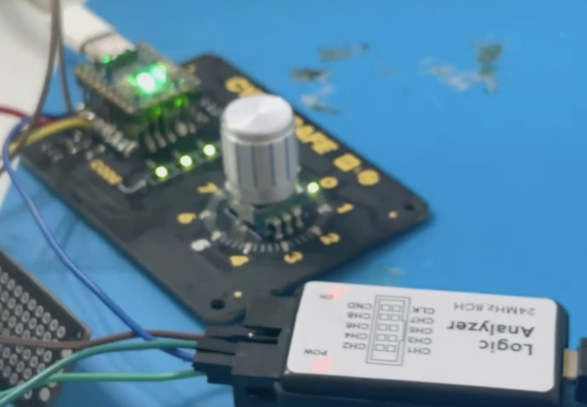
           
          <b>🎬 Смотреть</b>
        </a>
      

    </td>
  </tr>
</table>

> [!IMPORTANT]
> Скрипт глитч-атаки - [тык-тык](./glitch_src/glitch_script.py).

 

### **2.7. Side-Channel атака**

  

Нажмите, чтобы развернуть

 

<h1 align="center">Суть</h1>

В прошивке проверка пароля реализована небезопасно с точки зрения времени. Устройство сравнивает цифры по одной и прерывается на первой ошибке, но при этом тратит фиксированную задержку на каждую совпавшую цифру. Из-за этого время отклика линейно растёт: чем больше ведущих цифр угадано, тем дольше устройство думает перед тем, как показать ошибку. Мы измерили эту разницу - примерно 50 мс на каждую верную цифру. Это позволяет подбирать код не целиком, а по одной цифре. Пространство перебора сокращается с 10 000 комбинаций до 40 попыток.

<table>
  <tr>
    <td width="50%" valign="center">
      <h1 align="center">1. Подготовка</h1>
        
Для фиксации временных задержек использовали логический анализатор.

        

          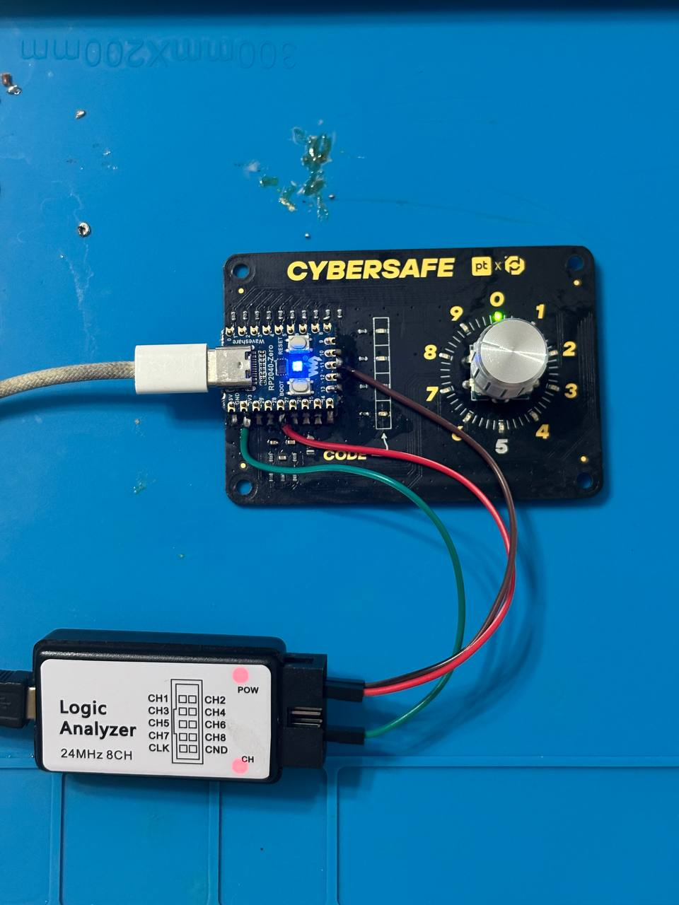
        

        
Первый канал подключили к линии кнопки - он фиксировал момент нажатия. Второй канал подключили к управляющему выводу индикаторной лампочки - он фиксировал момент реакции устройства. В программе анализатора настроили курсор для замера разницы времени между спадом на первом канале и нарастанием на втором.

    </td>
    <td width="50%" valign="center">
        

          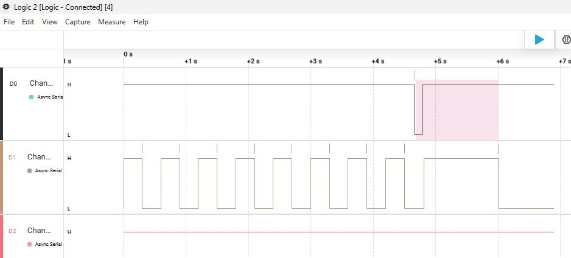
        

    </td>
  </tr>
</table>

<table>
  <tr>
    <td width="50%" valign="center">
      <h1 align="center">2. Выявление уязвимости</h1>
        
При вводе заведомо неверных комбинаций обнаружили, что время отклика не постоянно. Оно зависит от того, на какой позиции находится первая неверная цифра - классический признак последовательной проверки с ранним выходом. Эмпирически зафиксировали пороги: около 1.20 с при неверной первой цифре, 1.25 с при верной первой и неверной второй, 1.30 с при верных первых двух, 1.35 с при верных первых трёх.

    </td>
    <td width="50%" valign="center">
        

          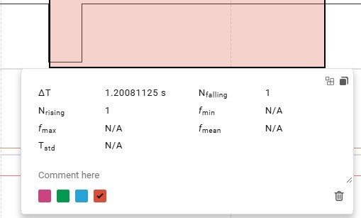
        

    </td>
  </tr>
</table>

<table>
  <tr>
    <td width="50%" valign="center">
      <h1 align="center">3. Алгоритм подбора</h1>
        
Обнаруженная зависимость позволяет применять метод последовательного уточнения. Пространство перебора сокращается с 10 000 комбинаций до 4 * 10 = 40 попыток.

        
На первом шаге фиксируем хвост как 000 и перебираем первую цифру от 0 до 9. Как только время отклика меняется с 1.20 с на 1.25 с - первая цифра найдена.

        

          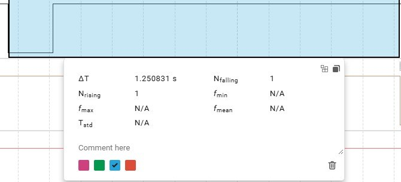
        

        
На втором шаге фиксируем найденную цифру, хвост оставляем 00 и перебираем вторую. Скачок с 1.25 с до 1.30 с означает, что вторая цифра верна.

        

          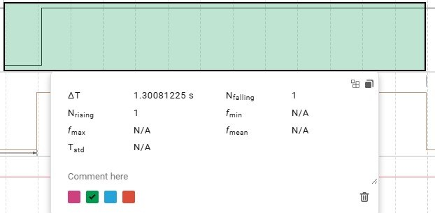
        

    </td>
    <td width="50%" valign="center">
        
На третьем шаге фиксируем первые две, перебираем третью. Скачок с 1.30 с до 1.35 с - третья найдена. 

        

          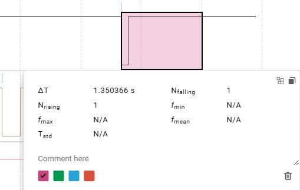
        

        
На четвёртом шаге фиксируем первые три и перебираем последнюю. Здесь критерий другой - не задержка ошибки, а срабатывание разблокировки.

    </td>
  </tr>
</table>

<h1 align="center">Итог</h1>

Уязвимость подтверждена: реализация проверки пароля не является константной по времени. Линейная задержка позволяет провести эффективную timing-атаку. Количество необходимых попыток сокращается с 10 000 до максимум 40, что делает атаку выполнимой вручную за несколько минут, без автоматизированных скриптов перебора. Это side-channel атака, не требующая ни разборки устройства, ни чтения прошивки. Достаточно физического доступа к линиям кнопки и индикатора.

 

### **2.8. Выпаивание чипа памяти**

  

Нажмите, чтобы развернуть

 

<table>
  <tr>
    <td width="50%" valign="center">
      <h1 align="center">Цель</h1>
        
Получение полного бинарного дампа энергонезависимой памяти (SPI Flash) аппаратного токена CyberSafe для последующего статического анализа и реверс-инжиниринга.

    </td>
    <td width="50%" valign="center">
      <h3 align="center">Оборудование</h3>
        <ui>
          <li><b>Программатор:</b> CH341A с выполненной аппаратной доработкой (3.3V мод по логическим линиям для предотвращения повреждения SPI Flash).</li>
          <li><b>Паяльное оборудование:</b> термовоздушная паяльная станция (ТВПС), пинцет.</li>
          <li><b>Расходные материалы:</b> флюс для пайки SMD/BGA, полиимидный термоскотч (Kapton tape).</li>
          <li><b>Адаптер:</b> переходная плата / сокетка под корпус USON8.</li>
        </ui>
      <h3 align="center">Программное обеспечение</h3>
        <ui>
          <li><b>NeoProgrammer:</b> для работы с программатором CH341A.</li>
        </ui>
    </td>
  </tr>
</table>
  

<table>
  <tr>
    <td width="50%" valign="center">
      <h1 align="center">Подготовка платы и термозащита</h1>
        <ol>
          <li>Плата CyberSafe была зафиксирована на рабочем столе.</li>
          <li>Для предотвращения сдува и перегрева обвязки микроконтроллера RP2040 и пассивных компонентов вся плата, за исключением микросхемы SPI Flash в корпусе USON8, была заклеена полиимидным термоскотчем.</li>
          <li>На выводы микросхемы памяти нанесен флюс.</li>
        </ol>
    </td>
    <td width="50%" valign="center">
        

          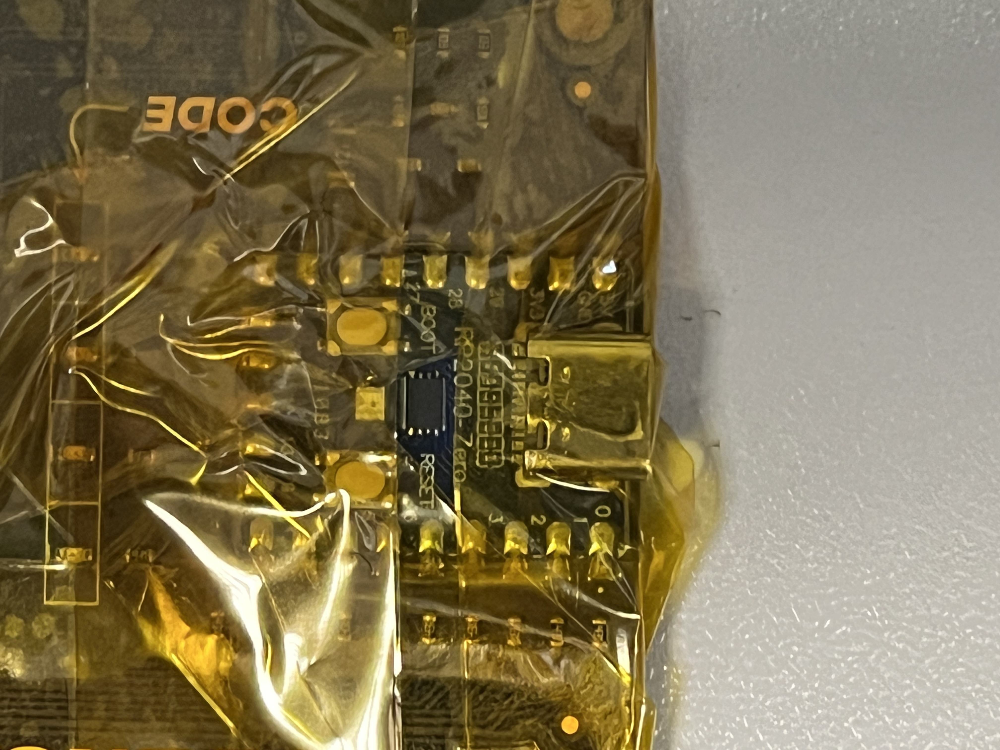
        

    </td>
  </tr>
</table>

<table>
  <tr>
    <td width="50%" valign="center">
      <h1 align="center">Демонтаж микросхемы памяти</h1>
        <ol>
          <li>Термовоздушной паяльной станцией произведен аккуратный и равномерный прогрев области чипа памяти.</li>
          <li>После расплавления припоя микросхема снята с контактных площадок платы с помощью пинцета.</li>
          <li>Контактные площадки чипа (и при необходимости самой платы) очищены от остатков флюса.</li>
        </ol>
    </td>
    <td width="50%" valign="center">
        

          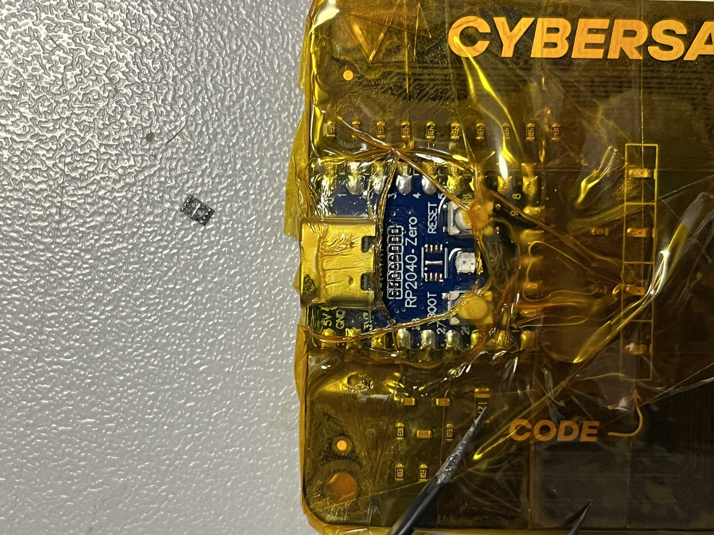
        

    </td>
  </tr>
</table>

<table>
  <tr>
    <td width="50%" valign="center">
      <h1 align="center">Подключение к программатору</h1>
        <ol>
          <li>Демонтированный чип USON8 выровнен и аккуратно впаян на переходную плату (или установлен в сокетку USON8).</li>
          <li>Переходник с чипом установлен в ZIF-панель программатора CH341A.</li>
          <li>Программатор подключен к ПК.</li>
        </ol>
    </td>
    <td width="50%" valign="center">
        

          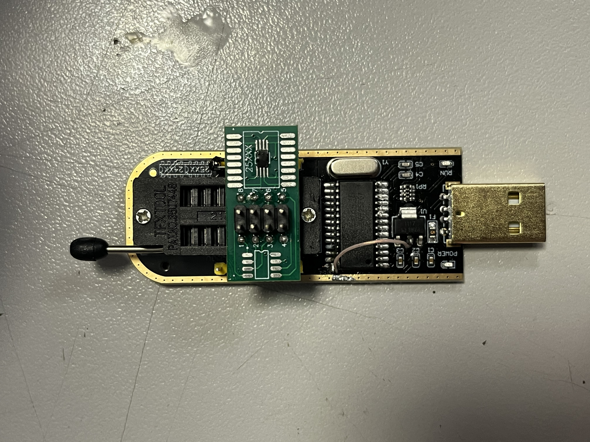
        

    </td>
  </tr>
</table>

<table>
  <tr>
    <td width="50%" valign="center">
      <h1 align="center">Считывание и верификация дампа</h1>
        <ol>
          <li>В интерфейсе <b>NeoProgrammer</b> вручную указана маркировка/наименование целевой микросхемы SPI Flash.</li>
          <li>Выполнена процедура считывания содержимого памяти.</li>
          <li><b>Проверка целостности (Verification):</b> для исключения сбоев чтения, ненадежного контакта выводов или ошибок передачи данных, чтение было выполнено <b>3 раза подряд</b> в отдельные файлы.</li>
          <li>Проведено сравнение контрольных сумм полученных дампов (<code>MD5</code> / <code>SHA-256</code>). Совпадение хэшей подтвердило стабильность чтения и валидность вычитанной прошивки.</li>
        </ol>
    </td>
    <td width="50%" valign="center">
        

          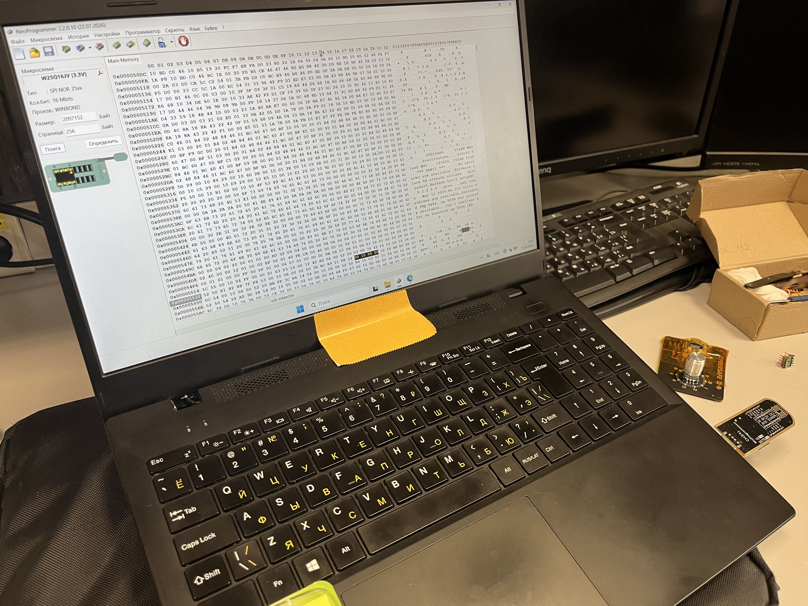
        

    </td>
  </tr>
</table>

  <table width="50%">
    <tr>
      <td>
        <h1 align="center">Итог</h1>
        
В результате процедур получен валидный бинарный дамп прошивки устройства CyberSafe (<code>cybersafe_flash_dump.bin</code>). Чип памяти сохранен и готов к дальнейшему анализу структуры файловой системы и бинарного кода RP2040.

      </td>
    </tr>
  </table>

  

  <h1 id="results">ИТОГИ</h1>

  <table>
    <thead>
      <tr>
        <th align="center">№</th>
        <th align="center">Направление</th>
        <th align="center">Тип</th>
        <th align="center">Сложность</th>
      </tr>
    </thead>
    <tbody>
      <tr>
        <td align="center">1</td>
        <td align="center"><a href="#21-извлечение-пароля">Извлечение пароля</a></td>
        <td align="center"><code>Software / Reverse Engineering</code></td>
        <td align="center">🟢 Низкая</td>
      </tr>
      <tr>
        <td align="center">2</td>
        <td align="center"><a href="#22-модификация-прошивки">Модификация прошивки</a></td>
        <td align="center"><code>Software / Firmware</code></td>
        <td align="center">🟢 Низкая</td>
      </tr>
      <tr>
        <td align="center">3</td>
        <td align="center"><a href="#23-криптоанализ-хранилища">Криптоанализ хранилища</a></td>
        <td align="center"><code>Software / Cryptanalysis</code></td>
        <td align="center">🟡 Средняя</td>
      </tr>
      <tr>
        <td align="center">4</td>
        <td align="center"><a href="#24-эмуляция-функций-прошивки">Эмуляция функций прошивки</a></td>
        <td align="center"><code>Software / Emulation</code></td>
        <td align="center">🔴 Высокая</td>
      </tr>
      <tr>
        <td align="center">5</td>
        <td align="center"><a href="#25-аппаратный-перебор">Аппаратный перебор</a></td>
        <td align="center"><code>Hardware</code></td>
        <td align="center">🔴 Высокая</td>
      </tr>
      <tr>
        <td align="center">6</td>
        <td align="center"><a href="#26-voltage-fault-injection">Voltage fault injection</a></td>
        <td align="center"><code>Hardware / Fault Injection</code></td>
        <td align="center">🔴 Высокая</td>
      </tr>
      <tr>
        <td align="center">7</td>
        <td align="center"><a href="#27-side-channel-атака">Side-Channel атака</a></td>
        <td align="center"><code>Hardware / Side-Channel</code></td>
        <td align="center">🔴 Высокая</td>
      </tr>
      <tr>
        <td align="center">8</td>
        <td align="center"><a href="#28-выпаивание-чипа-памяти">Выпаивание чипа памяти</a></td>
        <td align="center"><code>Hardware / Physical (Invasive)</code></td>
        <td align="center">🔴 Высокая</td>
      </tr>
    </tbody>
  </table>

  

  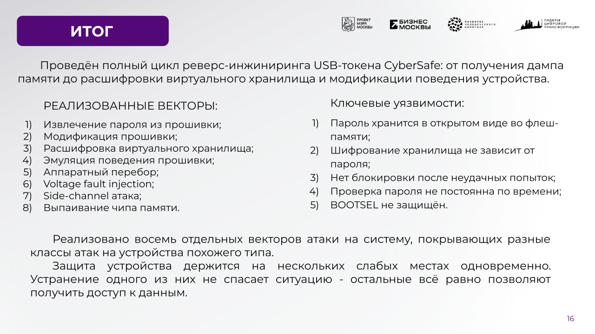

